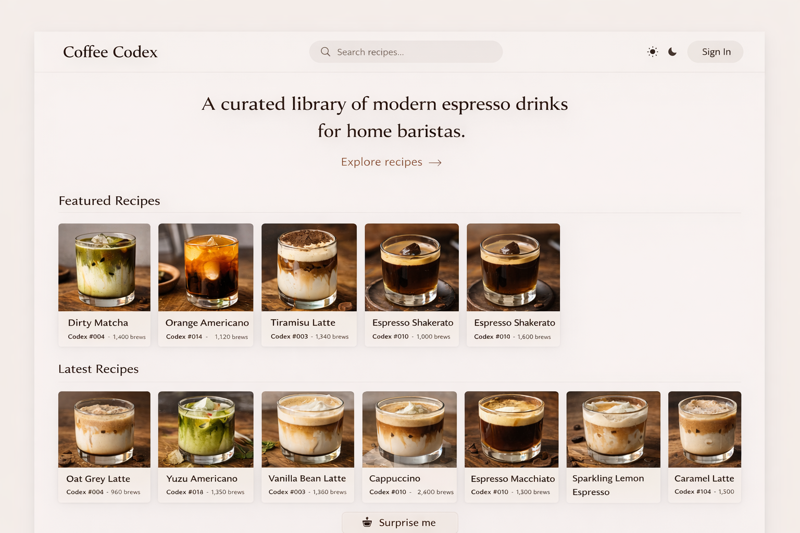
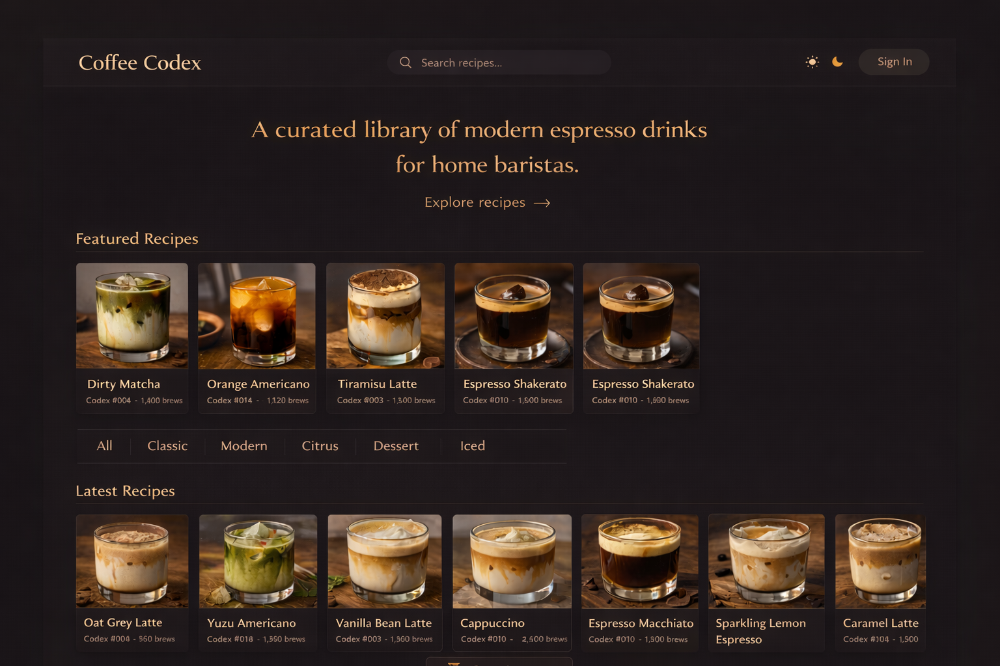
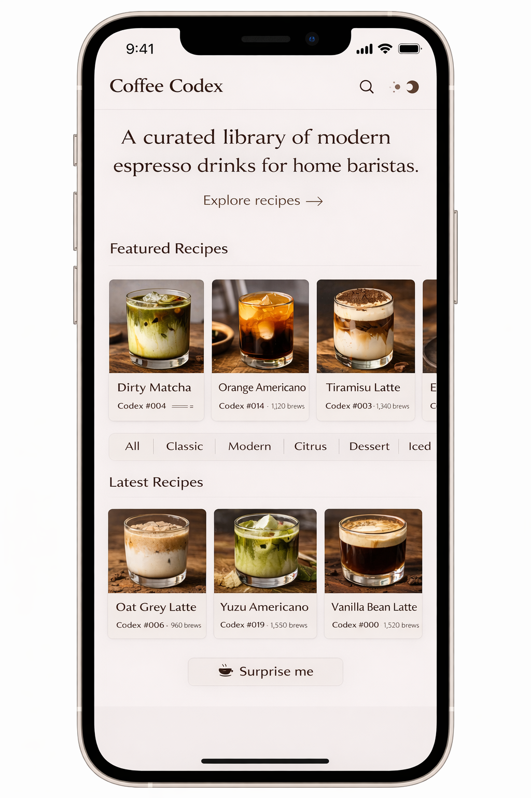
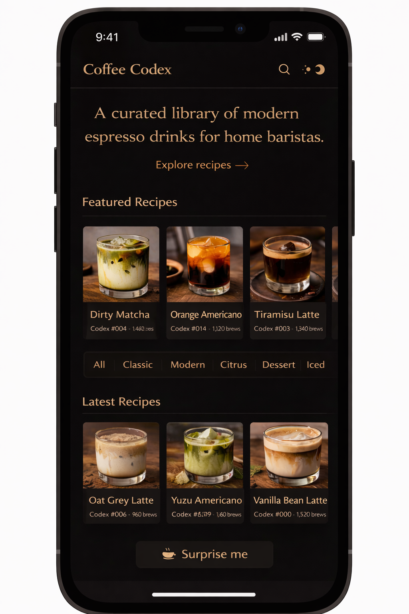
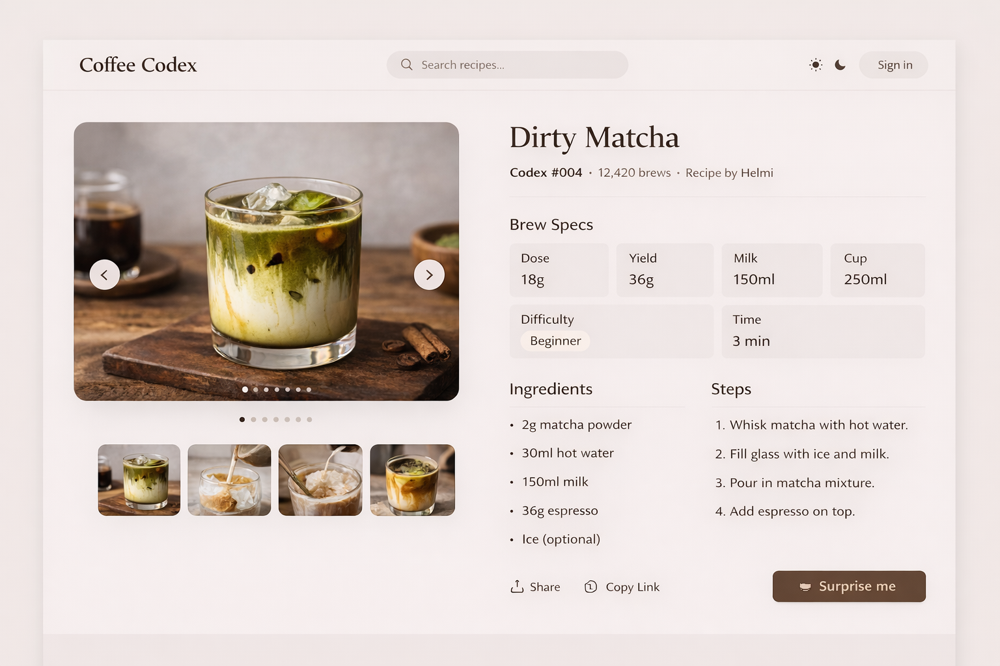
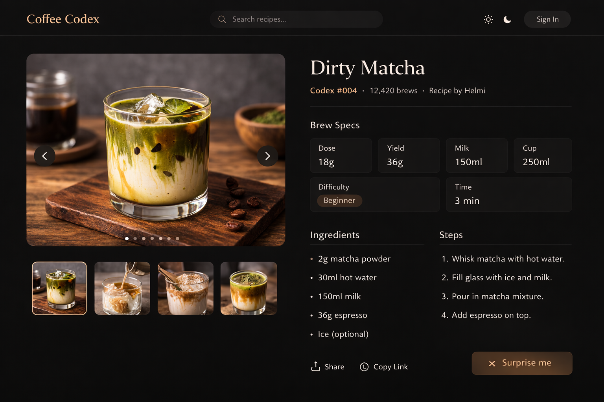
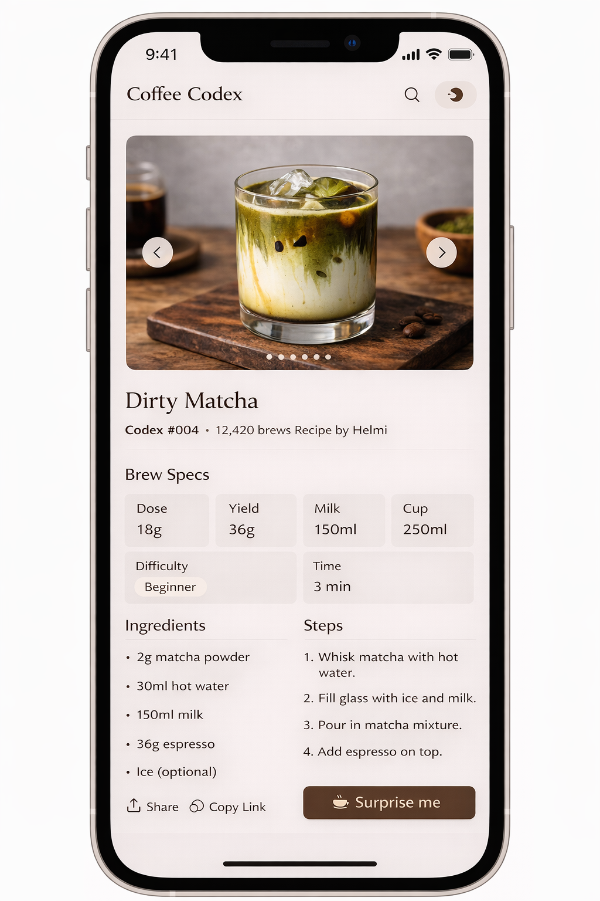
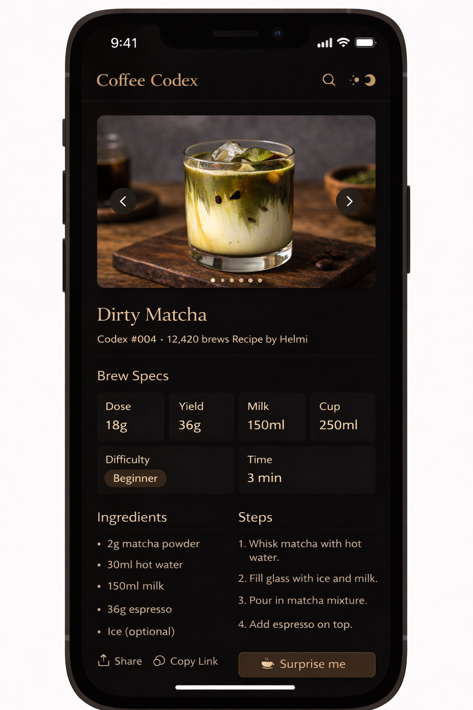

# Coffee Codex — UI Design

This document describes the intended UI layout for the Coffee Codex frontend.

Mockups represent the design direction and layout structure.

They are not pixel-perfect specifications.

---

# Landing Page

Desktop (Light Mode)

Desktop (Dark Mode)

Mobile (Light Mode)

Mobile (Dark Mode)

---

# Recipe Detail Page

Desktop (Light Mode)

Desktop (Dark Mode)

Mobile (Light Mode)

Mobile (Dark Mode)

---

# Layout Intent

Landing Page

Sections:

- hero section
- category filters
- recipe grid
- discovery button

Recipe Detail Page

Sections:

- image carousel
- brew specifications
- ingredients
- preparation steps
- metadata

---

# Design Principles

The UI should feel:

- minimal
- calm
- editorial

Large photography and whitespace are preferred over dense UI.

Design inspiration:

- Apple product pages
- Aesop product catalog
- specialty café menus
